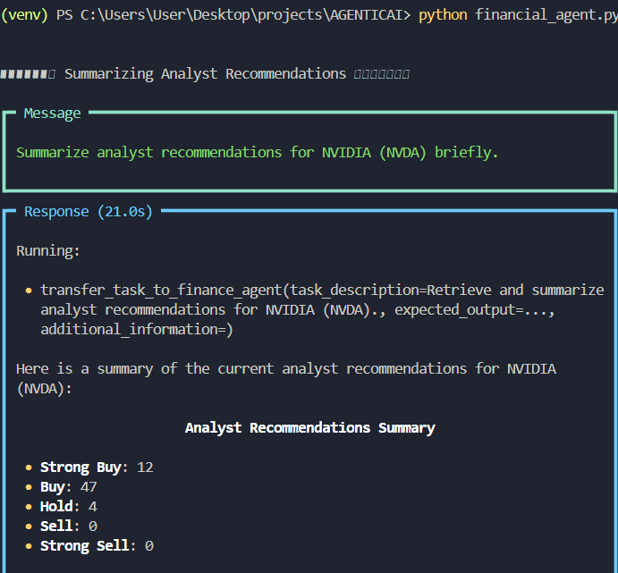
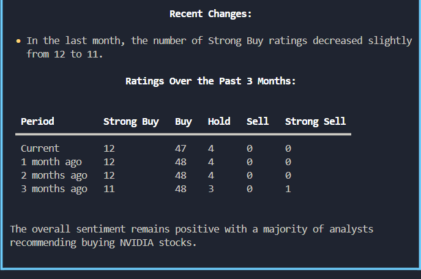
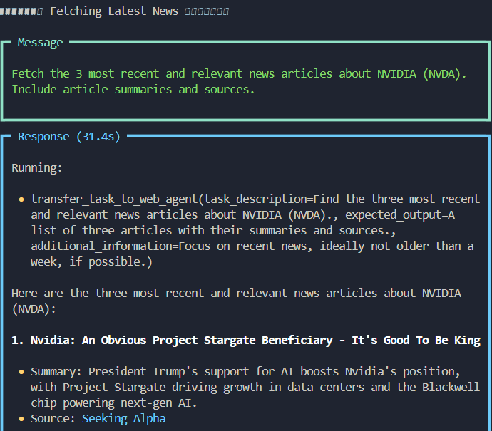
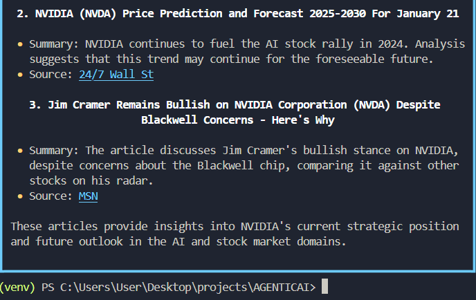
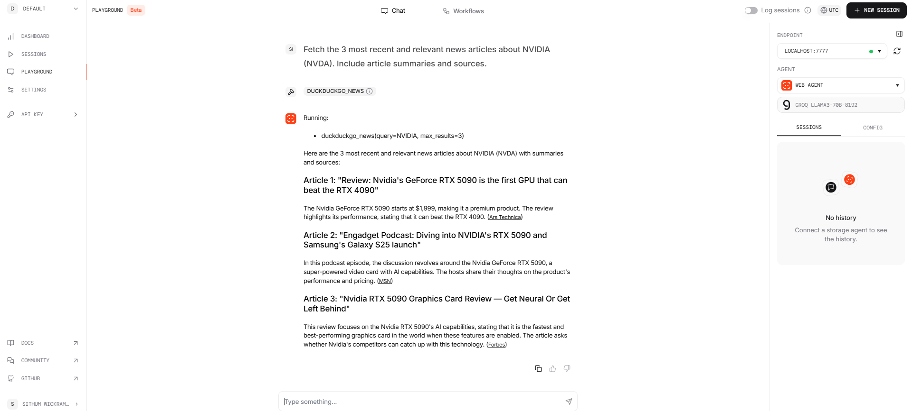

# Agentic AI Suite

Agentic AI is a versatile multi-agent application designed to provide advanced AI-powered solutions for web-based and financial queries. It leverages state-of-the-art AI models and tools for an interactive and efficient user experience.

---

## Table of Contents

1. [What is Phidata?](#what-is-phidata)
2. [What is Groq?](#what-is-groq)
3. [What is Agentic AI?](#what-is-agentic-ai)
4. [Features](#features)
5. [Prerequisites](#prerequisites)
6. [Setup and Usage](#setup-and-usage)  
    6.1. [Clone the Repository](#1-clone-the-repository)  
    6.2. [Create a Virtual Environment](#2-create-a-virtual-environment)  
    6.3. [Activate the Virtual Environment](#3-activate-the-virtual-environment)  
    6.4. [Install Dependencies](#4-install-dependencies)  
    6.5. [Set Up Environment Variables](#5-set-up-environment-variables)  
7. [Running the Application](#running-the-application)  
    7.1. [Financial Agent](#1-financial-agent)  
    7.2. [Playground](#2-playground)  
8. [Project Structure](#project-structure)  
9. [Example Use Cases](#example-use-cases)  
10. [Requirements](#requirements)  
11. [Technologies Used](#technologies-used)  
12. [Troubleshooting](#troubleshooting)  
13. [Contributing](#contributing)  
14. [License](#license)  
11. [Contributing](#contributing)
12. [License](#license)

---

## What is Phidata?
Phidata is a powerful framework designed for building multi-modal agents and workflows that combine memory, knowledge, tools, and reasoning. Its goal is to enable the creation of intelligent agents that can collaborate and solve complex tasks while providing seamless user interactions through an elegant Agent UI.

### Key Features:
1.Simple & Elegant: Enables building agents with minimal, beautiful code.
2.Powerful & Flexible: Allows integration of multiple tools to handle complex tasks.
3.Multi-Modal by Default: Supports text, images, audio, and video processing.
4.Multi-Agent Orchestration: Facilitates teamwork among agents for advanced workflows.
5.Agent UI: Provides a user-friendly interface for interacting with agents.
6.Built-in Capabilities:
  - Agentic RAG (Retrieval-Augmented Generation)
  - Reasoning
  - Structured Outputs
  - Monitoring & Debugging
  
### Example Use Cases:
- Web Search Agent: An agent that performs web searches with DuckDuckGo and includes sources in its responses.
- Finance Agent: A financial assistant capable of fetching stock prices, company news, and analyst recommendations.
- Image Agent: An agent that analyzes images and fetches related information or news.
- Agent Teams: Collaboration between multiple agents (e.g., a finance agent and a web search agent) to complete complex tasks efficiently.

### Installation & Setup:
Phidata simplifies development with straightforward installation steps:

Install the package:
`pip install -U phidata.`
Set up a virtual environment and configure keys (e.g., OpenAI API Key).
Build agents using the intuitive Phidata API.

For more details, visit [Phidata website](https://www.phidata.com/).

### Usage in This Project:
In this project, Phidata is used to build intelligent agents and workflows for handling web-based and financial queries. These agents leverage Phidata’s multi-modal capabilities, structured reasoning, and orchestration features to deliver the following:  

1. **Web Agent**: Retrieves accurate and up-to-date web information, ensuring responses include credible sources.  
2. **Finance Agent**: Provides financial insights, including stock prices, analyst recommendations, company information, and news, formatted for clarity and conciseness.  

By integrating these agents, the project achieves efficient task delegation and comprehensive solutions tailored to user needs.  

---
## What is Groq?
Groq represents a paradigm shift in AI inference, enabling instant intelligence for developers and enterprises. Its highlights include:

- **The Groq Language Processing Unit (LPU):** A hardware solution designed specifically for AI inference and language tasks, offering unparalleled speed, affordability, and scalability.
- **Cloud and On-Premises Availability:** Users can access Groq’s capabilities via GroqCloud™ or deploy LPUs in on-premise AI compute centers.
- **Energy Efficiency:** Groq’s design focuses on delivering maximum performance while minimizing energy consumption.

Groq is committed to democratizing AI by making its technology accessible to everyone.

For more details, visit [Groq's website](https://www.groq.com).

---

### Usage of Groq in This Project
In this project, Groq’s LPU is leveraged to power the inference engine for [specific component or API, e.g., "the ChatGroq API"]. This ensures:

- **Fast AI Inference:** Rapid and responsive user interactions.
- **Scalability:** Support for complex and high-volume queries.
- **Energy Efficiency:** Reduced resource consumption compared to traditional inference methods.

By incorporating Groq, the project achieves a new level of performance and user satisfaction.

---
## What is Agentic AI?

Agentic AI refers to systems designed with autonomous agents that specialize in specific tasks, allowing for efficient and collaborative problem-solving. These agents interact with each other and external tools to perform complex operations. 

This project features two key agents:

- **Web Agent**: Handles web-based queries, retrieves up-to-date information, and ensures credible responses with sources.
- **Finance Agent**: Specializes in financial tasks such as retrieving stock prices, analyst recommendations, company information, and news.

Both agents use the **Groq Llama3-70B** model for their AI functionalities.

---

## Features

### Multi-Agent System
The application combines individual agents to create a collaborative system. Each agent is equipped with specialized tools to perform distinct tasks:

1. **Web Agent**:
   - Fetches web-based information using DuckDuckGo.
   - Ensures responses include sources for credibility.

2. **Finance Agent**:
   - Uses YFinanceTools to retrieve:
     - Stock prices
     - Analyst recommendations
     - Company information
     - News
   - Displays data concisely using tables.

### Interactivity
- The **financial_agent.py** script allows users to interact directly with the agents through a command-line interface.
- The **playground.py** script provides a web-based playground interface accessible via the PhiData platform.

---
## Prerequisites
Before starting, ensure the following are installed:
```
Python (3.7 or higher)
pip (Python package installer)
Groq (For Llama3-8b-8192 model)
```
## Setup and Usage

#### 1. Clone the Repository
```
git clone https://github.com/Sithum-Bimsara/Agentic-AI-Suite.git
cd Agentic-AI-Suite
```
#### 2. Create a Virtual Environment
 
On Windows:
```
python -m venv venv
```
On macOS/Linux:
```
python3 -m venv venv
```
#### 3. Activate the Virtual Environment
 
On Windows:
```
.\venv\Scripts\activate
```
On macOS/Linux:
```
source venv/bin/activate
```
#### 4. Install Dependencies
```
pip install -r requirements.txt
```
#### 5. Set Up Environment Variables

Create a .env file in the root directory and add the following:
```
GROQ_API_KEY="your_groq_api_key"
PHI_API_KEY="your_gphi_api_key"

```
Replace the placeholders with your actual API keys.

## Running the Application

#### 1. Financial Agent

To interact with the financial agent directly:

```bash
python financial_agent.py
```

#### 2. Playground

To launch the playground:

```bash
python playground.py
```

- Open the playground in your browser by visiting:
  
  ```
  https://phidata.app/playground?endpoint=localhost%3A7777
  ```

- Set the endpoint to `localhost:7777`.

Interact with the agents directly in the PhiData Playground.

---

## Project Structure

```plaintext
AGENTICAI/
├── financial_agent.py    # Script for interacting with the financial agent.
├── playground.py         # Script for launching the PhiData playground.
├── requirements.txt      # Project dependencies.
├── .env                  # Environment variables (contains PHI_API_KEY).
└── README.md             # Project documentation.
```

---

## Example Use Cases

##### With Terminal





#### With Phidata Playground



---
## Requirements
The dependencies for this project are listed in requirements.txt. Some key packages include:
- phidata
- python-dotenv
- yfinance
- packaging
- duckduckgo-search
- fastapi
- uvicorn
- groq
- python-multipart
- google-generativeai

## Technologies Used
- **Groq Model**: Llama3-70B for advanced AI functionalities.
- **DuckDuckGo Tool**: For web searches with credible source inclusion.
- **YFinanceTools**: For financial data retrieval and analysis.
- **PhiData Playground**: For a web-based interactive interface.

---

## Contributing
Contributions are welcome! Feel free to open issues or submit pull requests for improvements.

---

## License
This project is licensed under the MIT License. See `LICENSE` for details.
